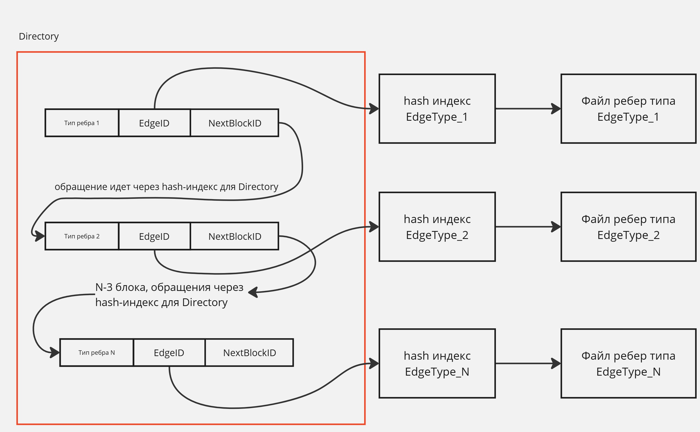

# Физическое хранение данных

## Vertex

Вершины будет храниться индексе. Вершины разных типов будут храниться в отдельных файлах.

Вершина состоит из:

- 1 байт на статус (удалена/нет)
- `ID` вершины
- `EdgeBlockDirectoryID`
- свойства вершины

Так как мы не будем поддерживать типы произвольных, меняющихся размеров, то свойства вершины будут иметь заранее определенный размер, засчет чего и вся структура вершины будет иметь заранее определенный размер.

## Directory

Для повышения локальности обхода была введена абстракция `Directory`. Под локальностью имеется в виду, что не придется бегать сначала в один файл, потом в другой. Сначала обходятся все ребра одного типа, потом другого, тем самым не будет "прыжков" по файлам. Основная же цель директории - нахождение ребер определенного типа.

Ребра разного типа в `Directory` абстрагированы блоками. То есть за ребра определённого типа будет отвечать блок.



Блок состоит из:

- `ID` блока
- типа ребра, за который он отвечает
- `FirstEdgeID` (id первого ребра из вершины с VertexID данного типа)
- `ID` следующего блока данной вершины

Данные будут храниться в hash индексе, чтобы это работало достаточно быстро +
это наверное единственное адекватное решение.

## Edge

Ребра разного типа будут храниться в разных файлах. Ребра состоят из:

- `ID` ребра
- свойства ребра
- `ID` следующего ребра данной вершины

Данные будут храниться в hash индексе, чтобы это работало достаточно быстро +
это наверное единственное адекватное решение.

## Общая схема

Для упрощения тут указаны не все поля.


# Почему отказались от прямых указателей на данные?

Есть сложности с повторным использованием места после того, как запись, которая там находилась - была удалена. Вся наша система была построена на том, что у записи есть `ID` и `[ID * размер_элемента, (ID + 1) * размер_элемента)` это место, где хранится этот элемент. По ТЗ необходимо сделать поддержку выставления `ID` пользователем. Для этого собирались разделить два вида `ID` - системные (отвечающие за то, где в памяти лежит элемент) и пользовательские (которые использует пользователь) и хранить хеш-таблицу для отображения одного в другое.

Neo4j компакцию делаю через копию базы, убирая пропуски во время копии, в этот момент
делается лок на всю базу: [источник](https://neo4j.com/docs/operations-manual/current/performance/space-reuse/)

Переиспользование участков памяти, где лежат уже удаленные элементы - ломает эту концепцию. Есть два подхода к этой проблеме:

1.  В какой-то момент делать `Stop-The-World` и сжимать записи (то есть заполнять пропущенные места), что будет довольно дорого из-за временного лока на ВСЮ базу данных, да и потом еще и индексы все надо будет перестроить и поменять "чиселки" во внешних ключах

2.  Во время вставки находить самое первое пустое место, но это ломает вставку за `O(1)`.
    BTW я придумал как делать это за `O(log N)`.
    Можно для файла хранить большую битовую маску. Если на `i-ой` позиции элемент удален/не был туда вставлен - храним `1`, если элемент вставлен и используется - `0`. Тогда задача сводится к нахождению самого левого нуля в массиве.

        Это можно сделать с помощью дерева отрезков (точнее его модификации). Как делать запрос `a[i] = 0/1` - очевидно. Как находить самую левую единицу - вещь менее тривиальная. Функцией объединения отрезков сделаем ИЛИ. Тогда если на отрезке есть хотя бы одна единица - в вершине, которая за нее отвечает лежит `1`. При поступлении запроса будем спускаться по дереву как можно левее. Сначала будем проверять значение в левом ребенке, если там `1`, то идем туда, если `0` - идем вправо. Итого получим `O(log N)`, так как дерево отрезков имеет логарифмическую высоту, а на каждом слое делается не более двух проверок.

# Запросы

### Запрос 1

Выбор вершин: обход DFS/BFS c фильтрацией по вершинам на пути (если она есть, то по временной метке – timestamp); выход – набор листовых вершин на заданной глубине.

```pseudo

```

### Запрос 2

Выбор всех вершин с заданным значением поля.

Будет выполняться запрос в B-Tree индекс. O(lg n)

### Запрос 3

Выбор всех вершин с заданным значением поля + фильтр по связям (степень вершины с учётом условия на связи данной вершины).

```pseudo

```

### Запрос 4

Подсчёт для каждой вершины суммы некоторого параметра по всем соседним вершинам с ограничением на связь/значение параметра (например, учитывать значение в сумме, если оно превышает некоторый порог).

```pseudo

```

### Запрос 5

Подсчёт всех «треугольников» в графе (без учёта ориентации).

```pseudo

```
